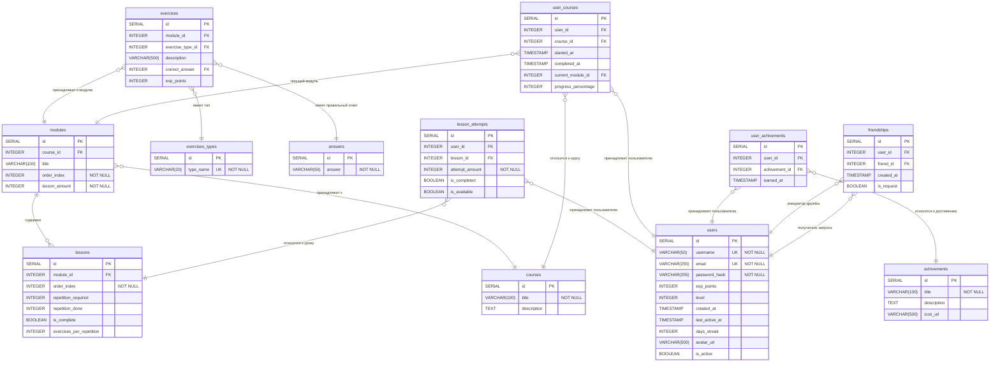

# 1. Введение
## 1.1. Краткое описание возможностей приложения
**Voider.learn** - приложения для обучения начинающих программистов при помощи коротких уроков в игровом формате

# 2. Стек технологий
## 2.1. Серверная часть приложения
- Node.js
- Express.js
- PostgreSQL
## 2.2. Клиентская часть приложения
- Flutter(dart)
- Dio - для запросов к API

# 3. Структура приложения
## 3.1. Архитектура приложения
### 3.1.1 Иерархия обучения

Пользователь выбирает курс, разделенный на модули. В модуле есть уроки, в каждом из которых будут задания. 

Упражнения не привязаны к урокам, и могут повторятся от одного урока к другому. Но упражнения привязаны к модулю. Упражнение может повторно появиться в модуле на "уровень" больше, но не наоборот.  Уроки, по сути, являются "чекпонитами", постепенно проходя которые пользователь проходит модуль. Модули идут последовательно, один за другим, в заранее прописанном порядке. Пройдя все модули, пользователь закрывает курс.
## 3.2. Архитектура БД
### 3.2.1. Список таблиц

**Информация о пользователях**
```sql
CREATE TABLE users (
	id SERIAL PRIMARY KEY,
	username VARCHAR(50) UNIQUE NOT NULL,
	email VARCHAR(255) UNIQUE NOT NULL,
	password_hash VARCHAR(255) NOT NULL,
	exp_points INTEGER DEFAULT 0,
	level INTEGER DEFAULT 0,
	created_at TIMESTAMP DEFAULT CURRENT_TIMESTAMP,
	last_active_at TIMESTAMP DEFAULT CURRENT_TIMESTAMP,
	days_streak INTEGER DEFAULT 0,
	avatar_url VARCHAR(500),
	is_active BOOLEAN DEFAULT TRUE
);
```

**Список курсов**
```sql
CREATE TABLE courses (
	id SERIAL PRIMARY KEY,
	title VARCHAR(100) NOT NULL,
	description TEXT
);
```

**Список модулей**
```sql
CREATE TABLE modules (
	id SERIAL PRIMARY KEY,
	course_id INTEGER REFERENCES courses(id) ON DELETE CASCADE,
	title VARCHAR(100),
	order_index INTEGER NOT NULL, -- тут хранится порятдок модулей
	lesson_amount INTEGER NOT NULL -- кол-во уроков в модуле
);
```

**Список уроков**
```sql
CREATE TABLE lessons (
	id SERIAL PRIMARY KEY,
	module_id INTEGER REFERENCES modules(id) ON DELETE CASCADE,
	order_index INTEGER NOT NULL,
	repetition_required INTEGER NOT NULL DEFAULT 3,
	repetition_done INTEGER NOT NULL DEFAULT 0,
	is_complete BOOLEAN NOT NULL DEFAULT FALSE,
	exercises_per_repetition INTEGER NOT NULL DEFAULT 5
	);
```

**Список типов упражнений**
```sql
CREATE TABLE exercises_types (
	id SERIAL PRIAMRY KEY,
	type_name VARCHAR(20) UNIQUE NOT NULL
);
```

**Список всех заданий**
```sql
CREATE TABLE exercises (
	id SERIAL PRIMARY KEY,
	module_id INTEGER REFERENCES modules(id) ON DELETE CASCADE,
	exercise_type_id INTEGER REFERENCES exercise_types(id),
	description VARCHAR(500),
	correct_answer INTEGER REFERENCES answers(id) ON DELETE CASCADE,
	exp_points INTEGER DEFAULT 10
);
```

**Список возможных ответов**
```sql
CREATE TABLE answers (
	id SERIAL PRIMARY KEY,
	answer VARCHAR(50) NOT NULL
);
```

**Статистика по урокам**
```sql
CREATE TABLE lesson_attempts (
	id SERIAL PRIMARY KEY,
	user_id INTEGER REFERENCES users(id) ON DELETE CASCADE,
	lesson_id INTEGER REFERENCES lessons(id) ON DELETE CASCADE,
	attempt_amount INTEGER NOT NULL,
	is_completed BOOLEAN DEFAULT FALSE,
	is_available BOOLEAN DEFAULT FALSE,
	UNIQUE (user_id, lesson_id, attempt_amount)
);
```

**Курсы которые проходят пользователи**
```sql
CREATE TABLE user_courses (
	id SERIAL PRIMARY KEY,
	user_id INTEGER REFERENCES users(id) ON DELETE CASCADE,
	course_id INTEGER REFERENCES courses(id) ON DELETE CASCADE,
	started_at TIMESTAMP DEFAULT CURRENT_TIMESTAMP,
	completed_at TIMESTAMP,
	current_module_id INTEGER REFERENCES modules(id),
	progress_percentage INTEGER DEFAULT 0,
	UNIQUE(user_id, course_id)
);
```

**Список достижений**
```sql
CREATE TABLE achivements (
	id SERIAL PRIMARY KEY,
	title VARCHAR(100) NOT NULL,
	description TEXT,
	icon_url VARCHAR(500)
);
```

**Достижения, полученные пользователями**
```sql
CREATE TABLE user_achivements (
	id SERIAL PRIMARY KEY,
	user_id INTEGER REFERENCES users(id) ON DELETE CASCADE,
	achivement_id INTEGER REFERENCES achivements(id) ON DELETE CASCADE,
	earned_at TIMESTAMP DEFAULT CURRENT_TIMESTAMP,
	UNIQUE(user_id, achivement_id)
);
```

**Список друзей**
```sql
CREATE TABLE friendships (
	id SERIAL PRIMARY KEY,
	user_id INTEGER REFERENCES users(id) ON DELETE CASCADE,
	friend_id INTEGER REFERENCES users(id) ON DELETE CASCADE,
	created_at TIMESTAMP DEFAULT CURRENT_TIMESTAMP,
	is_request BOOLEAN DEFAULT TRUE, -- сначала запрос в друзья, при подтверждении становится FALSE
	UNIQUE(user_id, friend_id),
	CHECK(user_id != friend_id)
);
```

### 3.2.2 Диаграмма связей таблиц

## 3.2. Архитектура API
### 3.2.1. Регистрация/вход

**Регистрация нового пользователя**

_Request_
```http
POST http://site/api/v1/auth/register
```

_Body_
```json
{
	"username": "string",
	"email": "string",
	"password": "string"
}
```

_Response_
`201 Created`
```json
{
	"message": "user registered succsessfully",
	"token": "string"
	"user": {
		"id": 99999999,
		"username": "string",
		"email": "string",
		"created_at": "00:00:0000",
		"exp_points": 99999999,
		"level": 99999999,
		"days_streak": 99999999
	}
}
```

**Авторизация пользователя**

_Request_
```http
POST http://site/api/v1/auth/login
```

_Body_
```json
{
	"email": "string",
	"password": "string"
}
```

_Response_
`200 OK`
```json
{
	"message": "login successfull",
	"token": "string"
	"user": {
		"id": 99999999,
		"username": "string",
		"email": "string",
		"exp_points": 99999999,
		"level": 99999999,
		"avatar_url": "string",
		"days_streak": 99999999,
		"last_active_at": "00:00:0000"
	}
}
```
### 3.2.2. Главная страница
**Дорожная карта**

_Request_
```http
GET http://site/api/v1/home/roadmap
Authorization: Bearer <token>
```

_Response_
```json
{
	"user_info": {
		"id": 99999999,
		"username": "string",
		"level": 99999999,
		"exp_points": 99999999,
		"days_streak": 99999999,
	},
	"current_course": {
		"id": 99999999,
		"title": "string",
		"progress_percentage": 99999999,
		"current_module":{
			"id": 99999999,
			"title": "string",
			"order_index": 99999999
			"lessons": [
				{
					"id": 99999999,
					"order_index": 99999999,
					"repetition_required": 99999999,
					"repetition_done": 99999999,
					"is_complele": true
				
				},
			]
		}
	}
}
```

**Список курсов**

_Request_
```http
GET http://site/api/v1/home/courses
Authorization: Bearer <token>
```

_Response_
```json
{
	"courses_available":[
		{
			"id": 99999999,
			"title": "string"
		},
		{
			"id": 99999999,
			"title": "string"
		}
	],
	"user_courses": [
		{
			"id": 99999999,
			"title": "string",
			"course_progress": 99999999,
			"is_current": true
		},
		{
			"id": 99999999,
			"title": "string",
			"course_progress": 99999999,
			"is_current": false
		}
    ]
}
```

**Прохождение урока**

_Request_
```http
GET http://site/api/v1/home/lessos/:id
Authorization: Bearer <token>
```

_Response_
```json
{
	"id": 99999999,
	"exercises_amount": 99999999,
	"current_repetition": 99999999,
	"exercises": [
		{
			"id": 99999999,
			"exercise_type": "string",
			"exp_points": 99999999,
			"description": "string",
			"answers": [
				{
					"id": 9999999999,
					"answer": "string"
				},
				{
					"id": 9999999999,
					"answer": "string"
				},
				{
					"id": 9999999999,
					"answer": "string"
				},
				{
					"id": 9999999999,
					"answer": "string"
				}
				],
			"correct_answer": 99999999,
		},
		{
			"id": 99999999,
			"exercise_type": "string",
			"exp_points": 99999999,
			"description": "string",
			"answers": [
				{
					"id": 9999999999,
					"answer": "string"
				},
				{
					"id": 9999999999,
					"answer": "string"
				},
				{
					"id": 9999999999,
					"answer": "string"
				},
				{
					"id": 9999999999,
					"answer": "string"
				}
				],
			"correct_answer": 99999999,
		},
		{
			"id": 99999999,
			"exercise_type": "string",
			"exp_points": 99999999,
			"description": "string",
			"answers": [
				{
					"id": 9999999999,
					"answer": "string"
				},
				{
					"id": 9999999999,
					"answer": "string"
				},
				{
					"id": 9999999999,
					"answer": "string"
				},
				{
					"id": 9999999999,
					"answer": "string"
				}
			],
			"correct_answer": 99999999,
		},
	],
}
```

**Результат прохождения урока**

_Request_
```http
POST http://site/api/v1/home/lesson
Authorization: Bearer <token>
```

_Body_
```json
{
	"id": 99999999,
	"is_repetition_complete": true,
	"current_repetition": 99999999,
	"exp_earned": 99999999
}
```

_Response_
`200 Ok`
```json
{
	"id": 99999999,
	"is_complete": 99999999,
	"exp_earned": 99999999,
}
```

### 3.2.3 Профиль пользователя
**Профиль пользователя**

_Request_
```http
GET http://site/api/v1/profile
Authorization: Bearer <token>
```

_Response_
```json
{
	"user_info": {
		"id": 99999999,
		"username": "string",
		"level": 99999999,
		"exp_points": 99999999,
		"days_streak": 99999999,
		"avatar_url": "string",
	},
}
```

_Request_
```http
PUT http://site/api/v1/profile
Authorization: Bearer <token>
```

_Body_
```json
{
	"user_info": {
		"id": 99999999,
		"username": "string",
		"level": 99999999,
		"exp_points": 99999999,
		"days_streak": 99999999,
		"avatar_url": "string",
	},
}
```

_Response_
`200 ok`
```json
{
	"user_info": {
		"id": 99999999,
		"username": "string",
		"level": 99999999,
		"exp_points": 99999999,
		"days_streak": 99999999,
		"avatar_url": "string",
	},
}
```

**Достижения пользователя**

_Request_
```http
GET http://site/api/v1/profile/achivements
Authorization: Bearer <token>
```

_Response_
```json
{
	{
		"id": 99999999,
		"title": "string",
		"dexription": "string",
		"icon_url": "string",
	},
	{
		"id": 99999999,
		"title": "string",
		"dexription": "string",
		"icon_url": "string",
	}
}
```

**Получение достижения**

_Request_
```http
POST http://site/api/v1/profile/achivements
Authorization: Bearer <token>
```

_Body_
```json
{
	"achivement_id": 99999999
}
```

_Response_
`200 Ok`
```json
{
	{
		"title": "string",
		"dexription": "string",
		"icon_url": "string",
	},
	{
		"title": "string",
		"dexription": "string",
		"icon_url": "string",
	}
}
```
