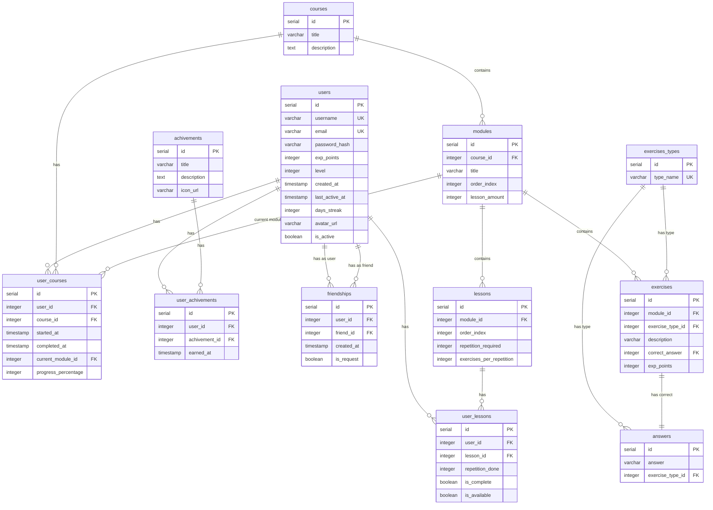

# 1. Введение
## 1.1. Краткое описание возможностей приложения
**Voider.learn** - приложения для обучения начинающих программистов при помощи коротких уроков в игровом формате

# 2. Стек технологий
## 2.1. Серверная часть приложения
- Node.js
- Express.js
- PostgreSQL
## 2.2. Клиентская часть приложения
- Flutter(dart)
- Dio - для запросов к API

# 3. Структура приложения
## 3.1. Архитектура приложения
### 3.1.1 Иерархия обучения

Пользователь выбирает курс, разделенный на модули. В модуле есть уроки, в каждом из которых будут задания. 

Упражнения не привязаны к урокам, и могут повторятся от одного урока к другому. Но упражнения привязаны к модулю. Упражнение может повторно появиться в модуле на "уровень" больше, но не наоборот.  Уроки, по сути, являются "чекпонитами", постепенно проходя которые пользователь проходит модуль. Модули идут последовательно, один за другим, в заранее прописанном порядке. Пройдя все модули, пользователь закрывает курс.
## 3.2. Архитектура БД
### 3.2.1. Список таблиц

**Информация о пользователях**
```sql
CREATE TABLE IF NOT EXISTS users (
    id SERIAL PRIMARY KEY,
    username VARCHAR(50) UNIQUE NOT NULL,
    email VARCHAR(255) UNIQUE NOT NULL,
    password_hash VARCHAR(255) NOT NULL,
    exp_points INTEGER DEFAULT 0,
    level INTEGER DEFAULT 0,
    created_at TIMESTAMP DEFAULT CURRENT_TIMESTAMP,
    last_active_at TIMESTAMP DEFAULT CURRENT_TIMESTAMP,
    days_streak INTEGER DEFAULT 0,
    avatar_url VARCHAR(500),
    is_active BOOLEAN DEFAULT TRUE
   );
```

**Список курсов**
```sql
CREATE TABLE IF NOT EXISTS courses (
	id SERIAL PRIMARY KEY,
	title VARCHAR(100) NOT NULL,
	description TEXT
);
```

**Список модулей**
```sql
CREATE TABLE IF NOT EXISTS modules (
    id SERIAL PRIMARY KEY,
    course_id INTEGER REFERENCES courses(id) ON DELETE CASCADE,
    title VARCHAR(100),
    order_index INTEGER NOT NULL, -- тут хранится порятдок модулей
    lesson_amount INTEGER NOT NULL -- кол-во уроков в модуле
);
```

**Список уроков**
```sql
CREATE TABLE IF NOT EXISTS lessons (
    id SERIAL PRIMARY KEY,
    module_id INTEGER REFERENCES modules(id) ON DELETE CASCADE,
    order_index INTEGER NOT NULL,
    repetition_required INTEGER NOT NULL DEFAULT 3,
    exercises_per_repetition INTEGER NOT NULL DEFAULT 5
);
```

**Список типов упражнений**
```sql
CREATE TABLE IF NOT EXISTS exercises_types (
    id SERIAL PRIMARY KEY,
    type_name VARCHAR(20) UNIQUE NOT NULL
);
```

**Список всех заданий**
```sql
CREATE TABLE IF NOT EXISTS exercises (
    id SERIAL PRIMARY KEY,
    module_id INTEGER REFERENCES modules(id) ON DELETE CASCADE,
    exercise_type_id INTEGER REFERENCES exercises_types(id),
    description VARCHAR(500),
    correct_answer INTEGER REFERENCES answers(id) ON DELETE CASCADE,
    exp_points INTEGER DEFAULT 10
 );
```

**Список возможных ответов**
```sql
CREATE TABLE IF NOT EXISTS answers (
    id SERIAL PRIMARY KEY,
    answer VARCHAR(50) NOT NULL,
    exercise_type_id INTEGER REFERENCES exercise_types(id)
);
```

**Статистика по урокам**
```sql
CREATE TABLE IF NOT EXISTS user_lessons (
    id SERIAL PRIMARY KEY,
    user_id INTEGER REFERENCES users(id) ON DELETE CASCADE,
    lesson_id INTEGER REFERENCES lessons(id) ON DELETE CASCADE,
    repetition_done INTEGER NOT NULL DEFAULT 0,
    is_complete BOOLEAN DEFAULT FALSE,
    is_available BOOLEAN DEFAULT FALSE,
    UNIQUE (user_id, lesson_id, repetition_done)
);
```

**Курсы которые проходят пользователи**
```sql
CREATE TABLE IF NOT EXISTS user_courses (
	id SERIAL PRIMARY KEY,
	user_id INTEGER REFERENCES users(id) ON DELETE CASCADE,
	course_id INTEGER REFERENCES courses(id) ON DELETE CASCADE,
	started_at TIMESTAMP DEFAULT CURRENT_TIMESTAMP,
	completed_at TIMESTAMP,
	current_module_id INTEGER REFERENCES modules(id),
	progress_percentage INTEGER DEFAULT 0,
	UNIQUE(user_id, course_id)
);
```

**Список достижений**
```sql
CREATE TABLE IF NOT EXISTS achivements (
	id SERIAL PRIMARY KEY,
	title VARCHAR(100) NOT NULL,
	description TEXT,
	icon_url VARCHAR(500)
);
```

**Достижения, полученные пользователями**
```sql
CREATE TABLE IF NOT EXISTS user_achivements (
	id SERIAL PRIMARY KEY,
	user_id INTEGER REFERENCES users(id) ON DELETE CASCADE,
	achivement_id INTEGER REFERENCES achivements(id) ON DELETE CASCADE,
	earned_at TIMESTAMP DEFAULT CURRENT_TIMESTAMP,
	UNIQUE(user_id, achivement_id)
);
```

**Список друзей**
```sql
CREATE TABLE IF NOT EXISTS friendships (
    id SERIAL PRIMARY KEY,
    user_id INTEGER REFERENCES users(id) ON DELETE CASCADE,
    friend_id INTEGER REFERENCES users(id) ON DELETE CASCADE,
    created_at TIMESTAMP DEFAULT CURRENT_TIMESTAMP,
    is_request BOOLEAN DEFAULT TRUE, -- сначала запрос в друзья, при подтверждении становится FALSE
    UNIQUE(user_id, friend_id),
    CHECK(user_id != friend_id)
);
```

### 3.2.2 Диаграмма связей таблиц

## 3.2. Архитектура API
### 3.2.1. Регистрация/вход

**Регистрация нового пользователя**

_Request_
```http
POST http://site/api/v1/auth/register
```

_Body_
```json
{
	"username": "string",
	"email": "string",
	"password": "string"
}
```

_Response_
`201 Created`
```json
{
	"message": "user registered succsessfully",
	"token": "string"
	"user": {
		"id": 99999999,
		"username": "string",
		"email": "string",
		"created_at": "00:00:0000",
		"exp_points": 99999999,
		"level": 99999999,
		"days_streak": 99999999
	}
}
```

**Авторизация пользователя**

_Request_
```http
POST http://site/api/v1/auth/login
```

_Body_
```json
{
	"email": "string",
	"password": "string"
}
```

_Response_
`200 OK`
```json
{
	"message": "login successfull",
	"token": "string"
	"user": {
		"id": 99999999,
		"username": "string",
		"email": "string",
		"exp_points": 99999999,
		"level": 99999999,
		"avatar_url": "string",
		"days_streak": 99999999,
		"last_active_at": "00:00:0000"
	}
}
```
### 3.2.2. Главная страница

**Дорожная карта**

_Request_
```http
GET http://site/api/v1/home/roadmap
Authorization: Bearer <token>
```

_Response_
```json
{
	"user_info": {
		"id": 99999999,
		"username": "string",
		"level": 99999999,
		"exp_points": 99999999,
		"days_streak": 99999999,
	},
	"current_course": {
		"id": 99999999,
		"title": "string",
		"progress_percentage": 99999999,
		"current_module":{
			"id": 99999999,
			"title": "string",
			"order_index": 99999999
			"lessons": [
				{
					"id": 99999999,
					"order_index": 99999999,
					"repetition_required": 99999999,
					"repetition_done": 99999999,
					"is_complele": true
				},
			]
		}
	}
}
```


**Список курсов**

_Request_
```http
GET http://site/api/v1/home/courses
Authorization: Bearer <token>
```

_Response_
```json
{
	"courses_available":[
		{
			"id": 99999999,
			"title": "string"
		},
		{
			"id": 99999999,
			"title": "string"
		}
	],
	"user_courses": [
		{
			"id": 99999999,
			"course_progress": 99999999,
			"is_current": true
		},
		{
			"id": 99999999,
			"course_progress": 99999999,
			"is_current": false
		}
    ]
}
```


**Запись на курс**

_Request_
```http
POST http://site/api/v1/home/courses
Authorization: Bearer <token>
```

_Body_
```json
{
	"course_id": 99999999
}
```

_Response_
`200 ok`
```json
{
	"message": "course sucsessfuly added"
}
```


**Отмена курса**

_Request_
```http
DELETE http://site/api/v1/home/courses
Authorization: Bearer <token>
```

_Body_
```json
{
	"course_id": 99999999
}
```

_Response_
`200 ok`
```json
{
	"message": "Course was deleted"
}
```


**Прохождение урока**

_Request_
```http
PUT http://site/api/v1/home/lessos/begin
Authorization: Bearer <token>
```

_Body_
```json
{
	"lesson_id": 99999999,
}
```

_Response_
```json
{
	"exercises_amount": 99999999,
	"exercises": [
		{
			"id": 99999999,
			"exercise_type": "string",
			"exp_points": 99999999,
			"description": "string",
			"answers": [
				{
					"id": 9999999999,
					"answer": "string"
				},
				{
					"id": 9999999999,
					"answer": "string"
				},
				{
					"id": 9999999999,
					"answer": "string"
				},
				{
					"id": 9999999999,
					"answer": "string"
				}
			],
			"correct_answer": 99999999,
		},
		{
			"id": 99999999,
			"exercise_type": "string",
			"exp_points": 99999999,
			"description": "string",
			"answers": [
				{
					"id": 9999999999,
					"answer": "string"
				},
				{
					"id": 9999999999,
					"answer": "string"
				},
				{
					"id": 9999999999,
					"answer": "string"
				},
				{
					"id": 9999999999,
					"answer": "string"
				}
				],
			"correct_answer": 99999999,
		},
		{
			"id": 99999999,
			"exercise_type": "string",
			"exp_points": 99999999,
			"description": "string",
			"answers": [
				{
					"id": 9999999999,
					"answer": "string"
				},
				{
					"id": 9999999999,
					"answer": "string"
				},
				{
					"id": 9999999999,
					"answer": "string"
				},
				{
					"id": 9999999999,
					"answer": "string"
				}
			],
			"correct_answer": 99999999,
		},
	],
}
```

**Результат прохождения урока**

_Request_
```http
PUT http://site/api/v1/home/lesson/done
Authorization: Bearer <token>
```

_Body_
```json
{
	"id": 99999999,
	"is_repetition_complete": true,
}
```

_Response_
`200 Ok`
```json
{
	"id" 99999999,
	"user_id" 99999999,
	"lesson_id": 99999999,
	"repetition_done": false,
	"is_available": true
}
```

### 3.2.3 Профиль пользователя
**Профиль пользователя**

_Request_
```http
GET http://site/api/v1/profile
Authorization: Bearer <token>
```

_Response_
```json
{
	"user_info": {
		"id": 99999999,
		"username": "string",
		"level": 99999999,
		"exp_points": 99999999,
		"days_streak": 99999999,
		"avatar_url": "string",
	},
}
```

_Request_
```http
PUT http://site/api/v1/profile
Authorization: Bearer <token>
```

_Body_
```json
{
	"user_info": {
		"id": 99999999,
		"username": "string",
		"level": 99999999,
		"exp_points": 99999999,
		"days_streak": 99999999,
		"avatar_url": "string",
	},
}
```

_Response_
`200 ok`
```json
{
	"user_info": {
		"id": 99999999,
		"username": "string",
		"level": 99999999,
		"exp_points": 99999999,
		"days_streak": 99999999,
		"avatar_url": "string",
	},
}
```

**Достижения пользователя**

_Request_
```http
GET http://site/api/v1/profile/achivements
Authorization: Bearer <token>
```

_Response_
```json
{
	{
		"id": 99999999,
		"title": "string",
		"dexription": "string",
		"icon_url": "string",
	},
	{
		"id": 99999999,
		"title": "string",
		"dexription": "string",
		"icon_url": "string",
	}
}
```

**Получение достижения**

_Request_
```http
POST http://site/api/v1/profile/achivements
Authorization: Bearer <token>
```

_Body_
```json
{
	"achivement_id": 99999999
}
```

_Response_
`200 Ok`
```json
[
	{
		"title": "string",
		"dexription": "string",
		"icon_url": "string",
	},
	{
		"title": "string",
		"dexription": "string",
		"icon_url": "string",
	}
]
```

# 4. Описание клиентской части приложения
## 4.1. Архитектура

Основным архитектурным паттерном является MVVM (Model, View, ViewModel), ну или что-то похожее на него :)
## 4.2. Файловая структура

Все основные файлы хранятся в папке `lib/`

### 4.2.1 `lib/`
Папка `lib/` хранит в себе папки(пункты 4.2.2 - 4.2.4) и 2 файла:
- `main.dart` - точка входа в программу
- `voider.dart` - виджет приложения

### 4.2.2 `lib/core/`

`lib/core/` - Папка с глобальными вещами, хранящая в себе:
- `assets/` - папка для изображений
- `shared_widgets/` - папка для общих виджетов, доступных на любом кране
- `router.dart` - файл с маршрутами и экранами, к которым они ведут
- `storage.dart` - файл хранящий логику работы с SecureStorage
- `theme.dart` - файл с описанием темы приложения

### 4.2.3 `lib/repositories/`

`lib/repositories/` - Хранит в себе всю логику работы с api (Model из MVVM):
 - `models/` - хранит все модели для работы с бд(может содержать вложенные папки)
 - `servises/` - хранит в себе файлы для работы с запросами к api и их парсингу в модели

### 4.2.4 - `lib/screens/`

`lib/screens/` - Хранит в себе все экраны. Содержит в себе View и ViewModel из MVVM архитектуры:

#### 4.2.4.1 Пример экрана `foo_screen/`

`foo_screen/` - папка с экраном
- `bloc/` - ViewModel - хранит в себе состояния(`state`), ивенты(`event`) и сам bloc, необходимый для менеджмента состояний. Может хранить в себе несколько папок с блоками, в случае когда экран может состоять из нескольких
- `view/` - папка для хранения представления(view) экрана(ов). Может хранить в себе несколько представлений, в случае когда экран может состоять из нескольких. Так же хранит в себе файл с экспортом представления
- `widget/` - папка с виджетами, которые используются на экране. Может хранить в себе дополнительные папки, если экран состоит из нескольких. Так же хранит в себе файл с экспортом виджетов
- `foo.dart` - файл, одноименный названию экрана. Служит для его экспорта

## 4.2.5 - (почти) полное файловое дерево
```markdown
lib/
	+- core/
	|	+- assets/
	|	+- shared_widgets/
	|	+- router.dart
	|	+- storage.dart
	|	+- theme.dart
	+- repositories/
	|	+- models/
	|	+- servises/
	+- screens/
	|	+- auth/
	|	|	+- bloc/
	|	|	+- view/
	|	|	+- widget/
	|	|	+- auth.dart
	|	+- home/
	|	|	+- bloc/
	|	|	|	+- courses/
	|	|	|	+- profile/
	|	|	|	+- roadmap/
	|	|	+- view/
	|	|	+- widget/
	|	|	|	+- courses/
	|	|	|	+- profile/
	|	|	|	+- roadmap/
	|	|	+- home.dart
	|	+- lesson/
	|		+- bloc/
	|		+- view/
	|		+- widget/
	|		+- lesson.dart
	+- main.dart
	+- voider.dart
```