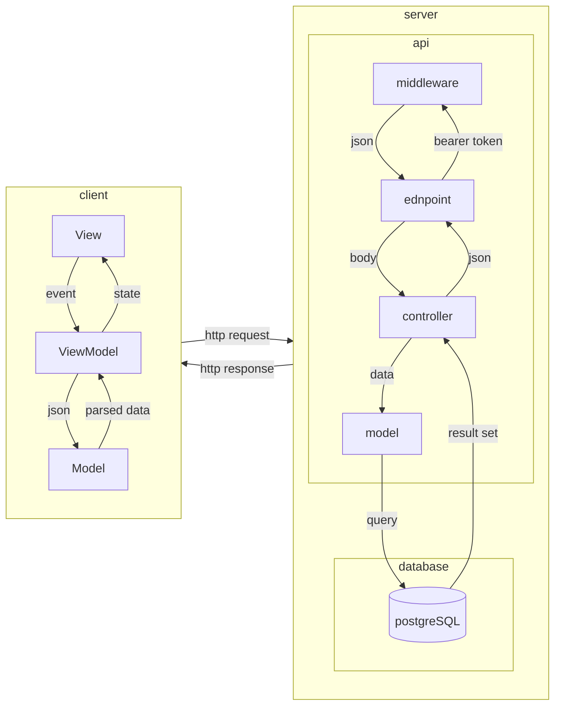

# 1. Введение
## 1.1. Краткое описание возможностей приложения
**Voider.learn** - приложения для обучения начинающих программистов при помощи коротких уроков в игровом формате

# 2 Общее описание системы
## 2.1. Архитектура Проекта


**Client**
1. Пользователь взаимодействует со `View`
2. `View` посылает событие(`event`) на `ViewModel`
3. `ViewModel` задает состояние (`state`) которое будет отрисовано на `view`
4. `ViewModel` посылает запрос к `API`
5. `ViewModel` разбирает `JSON` ответ в `Model`
6. `ViewModel` Обновляет состояние(`state`)
7. `View` отображает изменения

**Server**
1. На `endpoint` приходит запрос
2. `middleware` проверяет `bearer token`. При возникновении ошибке или отсутствии токена `middleware` отправляет `json` ответ на `endpoint`
3. `endpoint` передает тело(`body`) запроса в `controller`
4. `controller` передает данные(`data`) в `model`
5. `model` отправляет запрос(`query`) в базу данных(`database`)
6. Ответ(`reslut set`) из базы данных(`database`) получает `controller`
7. Он(`controller`) обрабатывает их, формирует и отправляет `json` ответ на `endpoint`
## 2.2. Стек технологий
## 2.2.1 Серверная часть приложения
- **Фреймворк** - Node.js, express.js
- **Aутентификация** - jsonwebtoke, bycript, argon
- **База данных** - PostgreSQL, Firebase-admin
## 2.2.2 Клиентская часть приложения
- **Фреймворк** - Flutter
- **http запросы** - Dio
- **Управление состоянием** - BLoC / GetIt
- **Уведомления** - Firebase Messaging

## 2.3 - Переменные среды

**Client**
```sh
API = "http://<site>/api/v1/"
```
- **API** - строковая переменная с хостом, где ___site___ - домен

**Server***
```sh
DB_USER = postgres
DB_HOST = host
DB_NAME = name
DB_PASSWORD = password
DB_PORT = port

JWT_SECRET = sercet
JWT_EXPIRES = <x><m/h/d>
```

- **DB_HOST** - строка с хостом
- **DB_NAME** - строка с именем базы
- **DB_PASSWORD** - строка с паролем к базе
- **DB_PORT** - число, номер порта
- **JWT_SECRET** - строка, jwt секрет
- **JWT_EXPIRES** - строка, устанавливает время для JWT токена. x - число, m/h/d - минуты/часы/дни 

# 3. Структура сервера
## 3.1. Список таблиц

**Информация о пользователях**

```sql
CREATE TABLE IF NOT EXISTS users (
    id SERIAL PRIMARY KEY,
    username VARCHAR(50) UNIQUE NOT NULL,
    email VARCHAR(255) UNIQUE NOT NULL,
    password_hash VARCHAR(255) NOT NULL,
    fcmToken TEXT,
    exp_points INTEGER DEFAULT 0,
    level INTEGER DEFAULT 0,
    created_at TIMESTAMP DEFAULT CURRENT_TIMESTAMP,
    last_active_at TIMESTAMP DEFAULT CURRENT_TIMESTAMP,
    days_streak INTEGER DEFAULT 0,
    avatar_url VARCHAR(500),
    is_active BOOLEAN DEFAULT TRUE
   );
```

**Список курсов**
```sql
CREATE TABLE IF NOT EXISTS courses (
	id SERIAL PRIMARY KEY,
	title VARCHAR(100) NOT NULL,
	description TEXT
);
```

**Список модулей**
```sql
CREATE TABLE IF NOT EXISTS modules (
    id SERIAL PRIMARY KEY,
    course_id INTEGER REFERENCES courses(id) ON DELETE CASCADE,
    title VARCHAR(100),
    order_index INTEGER NOT NULL, -- тут хранится порятдок модулей
    lesson_amount INTEGER NOT NULL -- кол-во уроков в модуле
);
```

**Список уроков**
```sql
CREATE TABLE IF NOT EXISTS lessons (
    id SERIAL PRIMARY KEY,
    module_id INTEGER REFERENCES modules(id) ON DELETE CASCADE,
    order_index INTEGER NOT NULL,
    repetition_required INTEGER NOT NULL DEFAULT 3,
    exercises_per_repetition INTEGER NOT NULL DEFAULT 5
);
```

**Список типов упражнений**
```sql
CREATE TABLE IF NOT EXISTS exercises_types (
    id SERIAL PRIMARY KEY,
    type_name VARCHAR(20) UNIQUE NOT NULL
);
```

**Список всех заданий**
```sql
CREATE TABLE IF NOT EXISTS exercises (
    id SERIAL PRIMARY KEY,
    module_id INTEGER REFERENCES modules(id) ON DELETE CASCADE,
    exercise_type_id INTEGER REFERENCES exercises_types(id),
    description VARCHAR(500),
    correct_answer INTEGER REFERENCES answers(id) ON DELETE CASCADE,
    exp_points INTEGER DEFAULT 10
 );
```

**Список возможных ответов**
```sql
CREATE TABLE IF NOT EXISTS answers (
    id SERIAL PRIMARY KEY,
    answer VARCHAR(50) NOT NULL,
    exercise_type_id INTEGER REFERENCES exercise_types(id)
);
```

**Статистика по урокам**
```sql
CREATE TABLE IF NOT EXISTS user_lessons (
    id SERIAL PRIMARY KEY,
    user_id INTEGER REFERENCES users(id) ON DELETE CASCADE,
    lesson_id INTEGER REFERENCES lessons(id) ON DELETE CASCADE,
    repetition_done INTEGER NOT NULL DEFAULT 0,
    is_complete BOOLEAN DEFAULT FALSE,
    is_available BOOLEAN DEFAULT FALSE,
    UNIQUE (user_id, lesson_id )
);
```

**Курсы которые проходят пользователи**
```sql
CREATE TABLE IF NOT EXISTS user_courses (
	id SERIAL PRIMARY KEY,
	user_id INTEGER REFERENCES users(id) ON DELETE CASCADE,
	course_id INTEGER REFERENCES courses(id) ON DELETE CASCADE,
	started_at TIMESTAMP DEFAULT CURRENT_TIMESTAMP,
	completed_at TIMESTAMP,
	current_module_id INTEGER REFERENCES modules(id),
	progress_percentage INTEGER DEFAULT 0,
	UNIQUE(user_id, course_id)
);
```

**Список достижений**
```sql
CREATE TABLE IF NOT EXISTS achivements (
	id SERIAL PRIMARY KEY,
	title VARCHAR(100) NOT NULL,
	description TEXT,
	icon_url VARCHAR(500)
);
```

**Достижения, полученные пользователями**
```sql
CREATE TABLE IF NOT EXISTS user_achivements (
	id SERIAL PRIMARY KEY,
	user_id INTEGER REFERENCES users(id) ON DELETE CASCADE,
	achivement_id INTEGER REFERENCES achivements(id) ON DELETE CASCADE,
	earned_at TIMESTAMP DEFAULT CURRENT_TIMESTAMP,
	UNIQUE(user_id, achivement_id)
);
```

**Список друзей**
```sql
CREATE TABLE IF NOT EXISTS friendships (
    id SERIAL PRIMARY KEY,
    user_id INTEGER REFERENCES users(id) ON DELETE CASCADE,
    friend_id INTEGER REFERENCES users(id) ON DELETE CASCADE,
    created_at TIMESTAMP DEFAULT CURRENT_TIMESTAMP,
    is_request BOOLEAN DEFAULT TRUE, -- сначала запрос в друзья, при подтверждении становится FALSE
    UNIQUE(user_id, friend_id),
    CHECK(user_id != friend_id)
);
```

**Список напоминаний**
```sql
CREATE TABLE IF NOT EXISTS reminders(
	id SERIAL PRIMARY KEY,
	title VARCHAR(48) NOT NULL,
	body VARCHAR(128) NOT NULL,
	days_past INTEGER NOT NULL DEFAULT 1
)
```
## 3.2. Запросы HTTP
### 3.2.1. Регистрация/вход

**Регистрация нового пользователя**

_Request_
```http
POST http://<site>/api/v1/auth/register
```

_Body_
```json
{
	"username": "string",
	"email": "string",
	"password": "string"
}
```

_Response_
`201 Created`
```json
{
	"message": "user registered succsessfully",
	"token": "string"
	"user": {
		"id": 99999999,
		"username": "string",
		"email": "string",
		"created_at": "00:00:0000",
		"exp_points": 99999999,
		"level": 99999999,
		"days_streak": 99999999,
		"avatar_url": "string"
	}
}
```

**Авторизация пользователя**

_Request_
```http
POST http://<site>/api/v1/auth/login
```

_Body_
```json
{
	"email": "string",
	"password": "string"
}
```

_Response_
`200 OK`
```json
{
	"message": "login successfull",
	"token": "string"
	"user": {
		"id": 99999999,
		"username": "string",
		"email": "string",
		"exp_points": 99999999,
		"level": 99999999,
		"days_streak": 99999999,
		"last_active_at": "00:00:0000",
		"avatar_url": "string"
	}
}
```
### 3.2.2. Главная страница

**Дорожная карта**

_Request_
```http
GET http://<site>/api/v1/home/roadmap
Authorization: Bearer <token>
```

_Response_
```json
{
	"user_info": {
		"id": 99999999,
		"username": "string",
		"level": 99999999,
		"exp_points": 99999999,
		"days_streak": 99999999,
	},
	"current_course": {
		"id": 99999999,
		"progress_percentage": 99999999,
		"current_module":{
			"id": 99999999,
			"title": "string",
			"order_index": 99999999
			"lessons": [
				{
					"id": 99999999,
					"order_index": 99999999,
					"repetition_required": 99999999,
					"repetition_done": 99999999,
					"is_complele": false,
					"is_available": true
				},
				{
					"id": 99999999,
					"order_index": 99999999,
					"repetition_required": 99999999,
					"repetition_done": 99999999,
					"is_complele": false,
					"is_available": true
				}
			]
		}
	}
}
```


**Список курсов**

_Request_
```http
GET http://<site>/api/v1/home/courses
Authorization: Bearer <token>
```

_Response_
```json
{
	"courses_available":[
		{
			"id": 99999999,
			"title": "string",
			"description": "string"
		},
		{
			"id": 99999999,
			"title": "string",
			"description": "string"
		}
	],
	"user_courses": [
		{
			"id": 99999999,
			"user_id": 99999999,
			"course_id" : 99999999,
			"started_at" : "string",
			"completed_at" : "string",
			"current_module_id" : 99999999,
			"course_progress": 99999999,
		},
    ]
}
```


**Запись на курс**

_Request_
```http
POST http://<site>/api/v1/home/courses
Authorization: Bearer <token>
```

_Body_
```json
{
	"course_id": 99999999
}
```

_Response_
`200 ok`
```json
{
	"message": "course sucsessfuly added"
}
```


**Отмена курса**

_Request_
```http
DELETE http://<site>/api/v1/home/courses
Authorization: Bearer <token>
```

_Body_
```json
{
	"course_id": 99999999
}
```

_Response_
`200 ok`
```json
{
	"message": "Course was deleted"
}
```


**Прохождение урока**

_Request_
```http
PUT http://<site>/api/v1/home/lessos/begin
Authorization: Bearer <token>
```

_Body_
```json
{
	"lesson_id": 99999999,
}
```

_Response_
```json
{
	"id" : 99999999,
	"exercises_amount": 99999999,
	"exercises": [
		{
			"id": 99999999,
			"description": "string",
			"answers": [
				{
					"id": 9999999999,
					"answer": "string",
					"exercise_type_id" : 99999999
				},
				{
					"id": 9999999999,
					"answer": "string",
					"exercise_type_id" : 99999999
				},
				{
					"id": 9999999999,
					"answer": "string",
					"exercise_type_id" : 99999999
				},
				{
					"id": 9999999999,
					"answer": "string",
					"exercise_type_id" : 99999999
				}
			],
			"correct_answer": 99999999,
		},
		{
			"id": 99999999,
			"description": "string",
			"answers": [
				{
					"id": 9999999999,
					"answer": "string",
					"exercise_type_id" : 99999999
				},
				{
					"id": 9999999999,
					"answer": "string",
					"exercise_type_id" : 99999999
				},
				{
					"id": 9999999999,
					"answer": "string",
					"exercise_type_id" : 99999999
				},
				{
					"id": 9999999999,
					"answer": "string",
					"exercise_type_id" : 99999999
				}
			],
			"correct_answer": 99999999,
		},	
	],
}
```

**Результат прохождения урока**

_Request_
```http
PUT http://<site>/api/v1/home/lesson/done
Authorization: Bearer <token>
```

_Body_
```json
{
	"id": 99999999,
	"exp_earned" : 99999999
}
```

_Response_
`200 Ok`
```json
{
	"id" 99999999,
	"user_id" 99999999,
	"lesson_id": 99999999,
	"repetition_done": 99999999,
	"is_complete" : false,
	"is_available": true
}
```

### 3.2.3 Профиль пользователя
**Профиль пользователя**

_Request_
```http
GET http://<site>/api/v1/profile
Authorization: Bearer <token>
```

_Response_
```json
{
	"user": {
		"id": 99999999,
		"username": "string",
		"email" : "string",
		"created_at" : "string",
		"exp_points": 99999999,
		"level": 99999999,
		"days_streak": 99999999,
		"avatar_url": "string",
	},
}
```

_Request_
```http
PUT http://<site>/api/v1/profile
Authorization: Bearer <token>
```

_Body_
```json
{
	"user_info": {
		"id": 99999999,
		"username": "string",
		"email" : "email",
		"exp_points": 99999999,
		"level": 99999999,
		"days_streak": 99999999,
		"avatar_url": "string",
	},
}
```

_Response_
`200 ok`
```json
{
	"user": {
		"id": 99999999,
		"username": "string",
		"email" : "string",
		"created_at" : "string",
		"exp_points": 99999999,
		"level": 99999999,
		"days_streak": 99999999,
		"avatar_url": "string",
	},
}
```

**Достижения пользователя**

_Request_
```http
GET http://<site>/api/v1/profile/achivements
Authorization: Bearer <token>
```

_Response_
```json
{
	{
		"id": 99999999,
		"title": "string",
		"dexription": "string",
		"icon_url": "string",
	},
	{
		"id": 99999999,
		"title": "string",
		"dexription": "string",
		"icon_url": "string",
	}
}
```

**Получение достижения**

_Request_
```http
POST http://<site>/api/v1/profile/achivements
Authorization: Bearer <token>
```

_Body_
```json
{
	"achivement_id": 99999999
}
```

_Response_
`200 Ok`
```json
[
	{
		"title": "string",
		"dexription": "string",
		"icon_url": "string",
	},
	{
		"title": "string",
		"dexription": "string",
		"icon_url": "string",
	}
]
```

### 3.2.4 Пользователи
**Список всех пользователей**

```http
GET http://<site>/api/v1/users
Authorization: Bearer <token>
```

_Response_
`200 Ok`
```json
[
	{
		"id": 99999999,
		"username": "string",
		"password_hash": "string",
		"exp_points": 99999999,
		"level": 99999999,
		"created_at": "string",
		"last_active_at": "string",
		"days_streak": 99999999,
		"avatar_url": 99999999,
		"is_active": true
	}
]
```

**обновление fcmToken**

```http
PUT http://<site>/api/v1/users/device
Authorization: Bearer <token>
```

_Body_
```json
{
	"fcmToken": "string"
}
```

_Response_
`200 Ok`
```json
{
	"message": "string"
}
```

**Отправка сообщения**

```http
PUT http://<site>/api/v1/users/message
Authorization: Bearer <token>
```

_Body_
```json
{
	"title": "string",
	"body": "string"
}
```

_Response_
`200 Ok`
```json
{
	"message": "string"
}
```


# 4. Структура клиента

Все основные файлы хранятся в папке `lib/`

### 4.1. `lib/`
Папка `lib/` хранит в себе папки(пункты 4.2.2 - 4.2.4) и 2 файла:
- `main.dart` - точка входа в программу
- `voider.dart` - виджет приложения

## 4.2. `lib/core/`

`lib/core/` - Папка с глобальными вещами, хранящая в себе:
- `assets/` - папка для изображений
- `shared_widgets/` - папка для общих виджетов, доступных на любом кране
- `router.dart` - файл с маршрутами и экранами, к которым они ведут
- `storage.dart` - файл хранящий логику работы с SecureStorage
- `theme.dart` - файл с описанием темы приложения

## 4.3. `lib/repositories/`

`lib/repositories/` - Хранит в себе всю логику работы с api (Model из MVVM):
 - `models/` - хранит все модели для работы с бд(может содержать вложенные папки)
 - `servises/` - хранит в себе файлы для работы с запросами к api и их парсингу в модели

## 4.4. - `lib/screens/`

`lib/screens/` - Хранит в себе все экраны. Содержит в себе View и ViewModel из MVVM архитектуры:

### 4.4.1 Пример экрана `foo_screen/`

`foo_screen/` - папка с экраном
- `bloc/` - ViewModel - хранит в себе состояния(`state`), ивенты(`event`) и сам bloc, необходимый для менеджмента состояний. Может хранить в себе несколько папок с блоками, в случае когда экран может состоять из нескольких
- `view/` - папка для хранения представления(view) экрана(ов). Может хранить в себе несколько представлений, в случае когда экран может состоять из нескольких. Так же хранит в себе файл с экспортом представления
- `widget/` - папка с виджетами, которые используются на экране. Может хранить в себе дополнительные папки, если экран состоит из нескольких. Так же хранит в себе файл с экспортом виджетов
- `foo.dart` - файл, одноименный названию экрана. Служит для его экспорта
